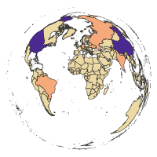

# Country-level Land Cover - categories and transitions 

## Country-level Land Cover Categories

[Country-level Land Cover Categories (CLCC)](https://cl-land-cover.netlify.com/clcc) has information about land cover categories areas (in km2) on a country level.
You can download the data files for different years from 1992 to 2015. 

## Country-level Land Cover Transitions

[Country-level Land Cover Transitions (CLCT)](https://cl-land-cover.netlify.com/clct) has information about transitions (net changes) of the land cover categories areas (in km2) on a country level over five-year periods.
Positive values indicate an increase of the given land cover category area and negative values indicate a decrease of the given land cover category area.
You can download the data files for different five-year periods between 1992 to 2015. 

## Country-level Land Cover Gross Changes

[Country-level Land Cover Gross Changes](https://cl-land-cover.netlify.com/clcgc) has information about gross changes of the land cover categories areas (in km2) on a country level over five-year periods.

## Data preparation

The scripts used for data preparation are available in the [`R`](R) folder.

### Steps (CLCC and CLCT)

1. Download [National Identifier Grid from SEDAC](https://sedac.ciesin.columbia.edu/data/set/gpw-v4-national-identifier-grid-rev11)
1. Download [ESA CCI Land Cover data for years 1992-2015](https://maps.elie.ucl.ac.be/CCI/viewer/)
1. Reproject land cover data to the [Equal Area Cylindrical](https://proj4.org/operations/projections/cea.html) projection
1. Split reprojected land cover data into 24 separate files (one file per year)
1. Simplify land cover categories into 9 broader IPCC (Intergovernmental Panel on Climate Change) categories
1. Reproject National Identifier Grid data to the [Equal Area Cylindrical](https://proj4.org/operations/projections/cea.html) projection and rasterize it
1. Calculate land cover categories compositions for each country in each year
1. Merge datasets and recalculate areas' unit from the number of cells to square kilometers
1. Calculate land cover transitions (net change in land cover categories compositions) over five-year periods
1. Join land cover categories and land cover transitions with the administrative areas from the National Identifier Grid dataset

### Steps (Gross Changes)

1. Download [National Identifier Grid from SEDAC](https://sedac.ciesin.columbia.edu/data/set/gpw-v4-national-identifier-grid-rev11)
1. Download [ESA CCI Land Cover data for years 1992-2015](https://maps.elie.ucl.ac.be/CCI/viewer/)
1. Reproject land cover data to the [Equal Area Cylindrical](https://proj4.org/operations/projections/cea.html) projection
1. Split reprojected land cover data into 24 separate files (one file per year)
1. Simplify land cover categories into 9 broader IPCC (Intergovernmental Panel on Climate Change) categories
1. Reproject National Identifier Grid data to the [Equal Area Cylindrical](https://proj4.org/operations/projections/cea.html) projection and rasterize it
1. Calculate one raster file for each five-year periods by combining two input rasters, e.g., a new value 12 of a pixel represents the change from 1 (agriculture) to 2 (forest)
1. Extract land cover transitions for each country in each five-year period
1. Calculate land cover gross changes, gains, and losses over five-year periods by processing of the land cover transitions data

## References

- Center for International Earth Science Information Network (CIESIN), Columbia University, (2018). Gridded Population of the World, Version 4 (GPWv4): National Identifier Grid, Revision 11. Palisades, NY: NASA Socioeconomic Data and Applications Center (SEDAC). https://doi.org/10.7927/H4TD9VDP
- ESA, 2017. European Space Agency Land Cover CCI Product User Guide Version 2.0. Tech. rep. https://maps.elie.ucl.ac.be/CCI/viewer/
- Netzel P., Nowosad J., Jasiewicz J., Niesterowicz J, Stepinski T., (2018). GeoPAT 2: user's manual. Zenodo. http://doi.org/10.5281/zenodo.1291123
- GDAL/OGR contributors (2018). GDAL/OGR Geospatial Data Abstraction software Library. Open Source Geospatial Foundation. URL http://gdal.org
- R Core Team (2019). R: A language and environment for statistical computing. R Foundation for Statistical Computing, Vienna, Austria. URL https://www.R-project.org/.
- Jonathan Asher Greenberg and Matteo Mattiuzzi (2018). gdalUtils: Wrappers for the Geospatial Data Abstraction Library (GDAL) Utilities. R package version 2.0.1.14. https://CRAN.R-project.org/package=gdalUtils
- Robert J. Hijmans (2019). raster: Geographic Data Analysis and Modeling. R package version 2.9-2. https://www.rspatial.org/
- Pebesma, E., 2018. Simple Features for R: Standardized Support for Spatial Vector Data. The R Journal 10 (1), 439-446, https://doi.org/10.32614/RJ-2018-009
- Hadley Wickham, Romain François, Lionel Henry and Kirill Müller (2019). dplyr: A Grammar of Data Manipulation. R package version 0.8.0.1. https://CRAN.R-project.org/package=dplyr
- Lionel Henry and Hadley Wickham (2019). purrr: Functional Programming Tools. R package version 0.3.2. https://CRAN.R-project.org/package=purrr
- Jakub Nowosad (2018). rgeopat2: Additional Functions for 'GeoPAT' 2. R package version 0.2.6.  https://CRAN.R-project.org/package=rgeopat2
- Maximillian H.K. Hesselbarth, Marco Sciaini, Jakub Nowosad and Sebastian Hanss (2019). landscapemetrics: Landscape Metrics for Categorical Map Patterns. R package version 1.1. https://r-spatialecology.github.io/landscapemetrics/